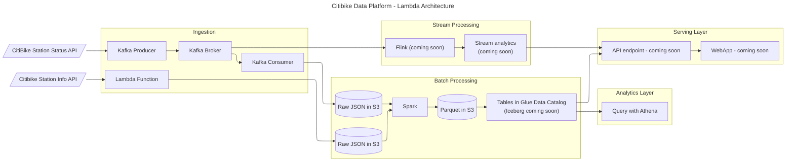

# Citibike Data Platform

## High Level Summary:

A complete end-to-end data pipeline to fetch data from various Citibike hosted API endpoints, do both streaming and batch data processing, and make the data available in a serving layer for both analytics and data visualization.

This project is also a place for me to experiment with a variety of Data Engineering technologies. In particular, this project includes:
- Various AWS infrastructure:
  - Lambda
  - EC2
  - Glue
  - Athena
  - S3
- Kafka brokers, producers, and consumers (deployed via Docker containers to tiny EC2 instances - AWS MSK is $$$$$)
- Spark/PySpark
- Docker
- GitHub Actions
- Terraform
- Flink (coming soon)
- Iceberg (coming soon)

### Architecture Diagram:

---
## To Do List - in no particular order

- [ ] Automate the Spark job to run daily to combine the small Kafka files and join on the station information, then dump into a single parquet and drop in a bucket with folders for partitioning
- [ ] Terraform to deploy Lambda function
- [ ] Terraform to deploy Lambda function role and add S3FullAccess permissions
- [ ] Terraform to deploy S3 buckets
- [ ] Terraform to deploy Glue Data Catalog table metadata
- [ ] Terraform to deploy Spark Glue job
- [ ] Mock Kafka unit tests for Kafka Producer and Kafka Consumer
- [ ] Mock AWS environment for unit testing the S3 put methods in the Lambda function and Kafka Consumer
- [ ] Refresh station information every so often - it probably changes

---
## Misc. Resources

Running Airflow in Docker:
https://airflow.apache.org/docs/apache-airflow/stable/howto/docker-compose/index.html

---

## Project Setup
1. Configure secrets in GitHub Actions
2. Configure variables in Hashicorp Cloud account

---
